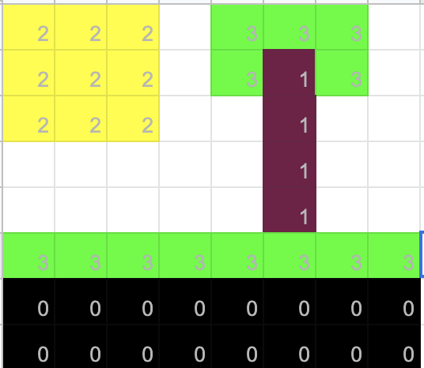

# jkhaliqi.github.io

Jacob Khaliqi's User Page

My favorite language is java

### Welcome to Jacob's homepage! <br>
<br>


**This is a picture of some pixel art**<br>
 <br>

[Click if you want to go to Next Section](#next-section)

# Heading
## This heading should be smaller
##### this heading is even smaller

**This is bold text** <br>
*This text is italicized* <br>
~~This text will get deleted~~ <br>
**This texts is *Extremely* important** <br>
***All this text is important*** <br>

Favorite quote coming from Eric Thomas:
> When You Want To Succeed As Bad As You Want To Breathe, Then You Will Be Successful

Use `git status` to list all new or modified files that haven't yet been committed.

Some basic Git commands are:
```
git status
git add
git commit
```

This site was built using [GitHub Pages](https://pages.github.com/).

# Next Section

[Click here for the relative link to the Pixel Art](Pixel_Art.png)

List of Hobbies:
- Playing basketball
- Playing volleyball
- Playing video games
- Hanging out with friends

Favorite athletes:
1. Lebron James
2. Cristiano Ronaldo
3. Muhammad Ali

Nested Lists

1. First list item
   - First nested list item
     - Second nested list item
     
 Task Lists to complete:    
- [x] Finish my changes
- [ ] Push my commits to GitHub
- [ ] Open a pull request <br>
:fire: :fire: :fire:


